# TOKEN · 词元 —— 游戏 CG 预告片

一部约 **5 分钟（5:06）** 的 2D 横版 RPG 游戏 CG，讲述 **大语言模型（LLM）架构出现前后的故事**：
从规则时代的“沉默”，到 AI 寒冬、反向传播、RNN / LSTM、word2vec、Seq2Seq 与注意力，
再到 **Transformer** 的诞生，以及之后的 BERT / GPT、规模定律、RLHF、RAG 与今天的前沿。

- 画面风格：前半段致敬 **LIMBO**（黑白剪影、浓雾、胶片颗粒、宽银幕遮幅），
  后半段致敬 **GRIS**（水彩纸纹、粉彩渐变、巨大的几何与石像）。
- 叙事机制借用 GRIS 的“找回颜色”：每一次技术突破都为世界夺回一种颜色——
  反向传播的 **红**、灯笼与 LSTM 的 **金**、词向量的 **蓝**，直到 Transformer 的 **全色谱绽放**，遮幅随之打开。
- RPG 元素：章节卡、**「获得技能」** 弹窗、**BOSS** 登场卡（遗忘之蛛 = 梯度消失）、对话框（ELIZA、ChatGPT）。
- **100% 程序化生成**：没有任何图片素材。所有画面由 Python（skia 矢量绘制 + numpy/OpenCV 后期）逐帧渲染，
  配乐与音效由 numpy 合成（钢琴、弦乐、人声合唱、FM 钟声、混响），并与时间轴逐帧同步。

输出规格：1920×1080，24 fps，H.264 + AAC 立体声。

| | |
|---|---|
| 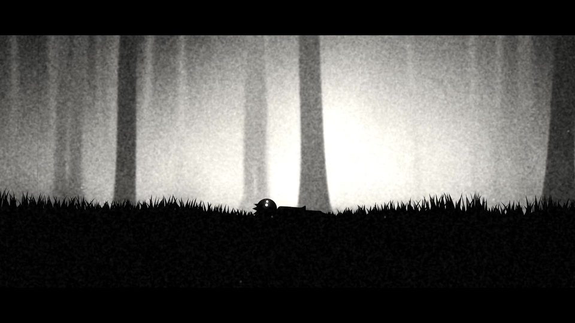 | 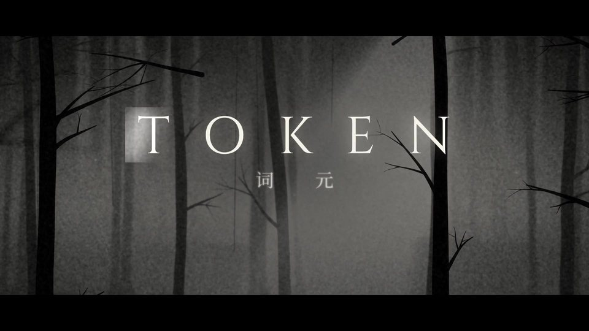 |
| 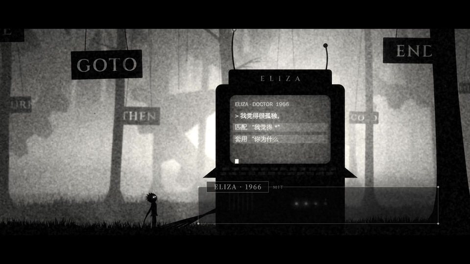 | 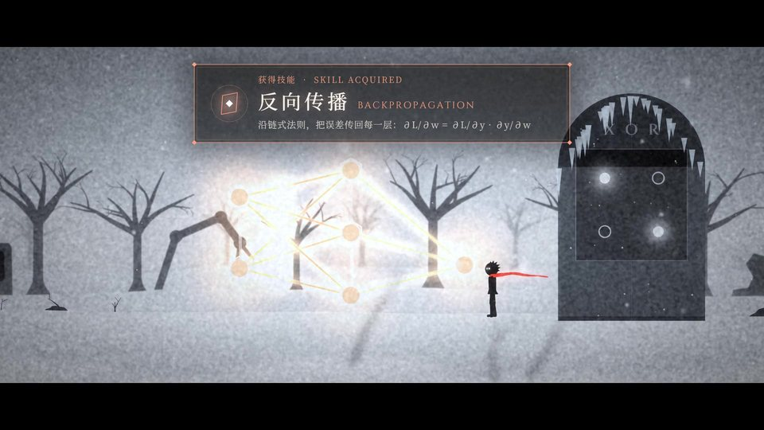 |
| 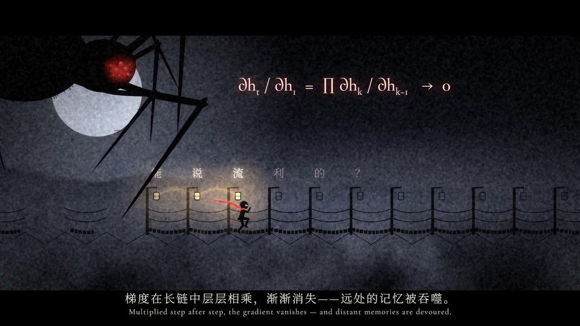 | 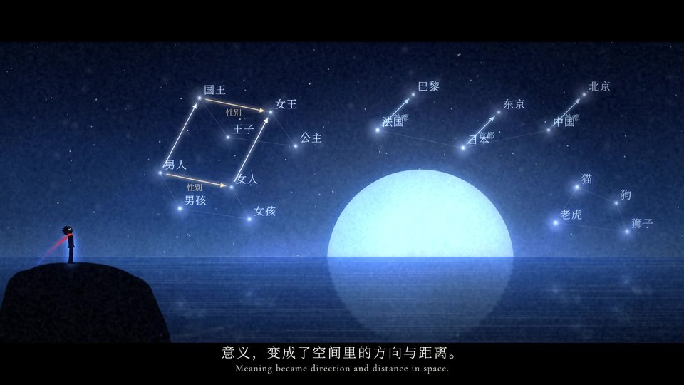 |
| 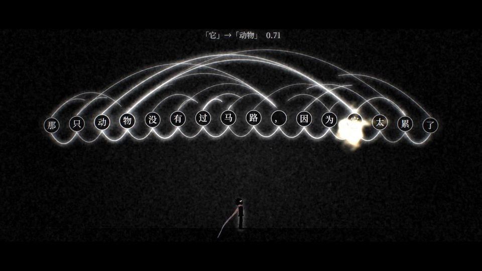 | 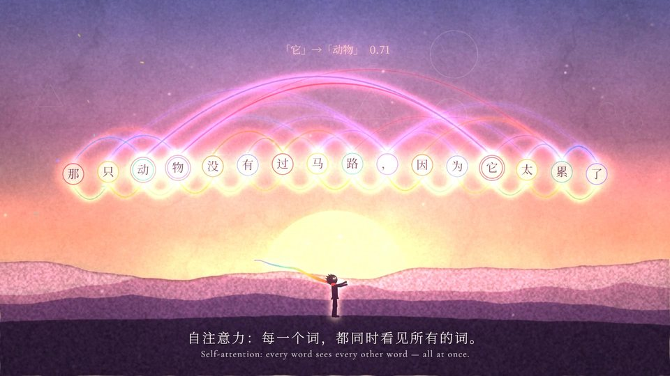 |
| 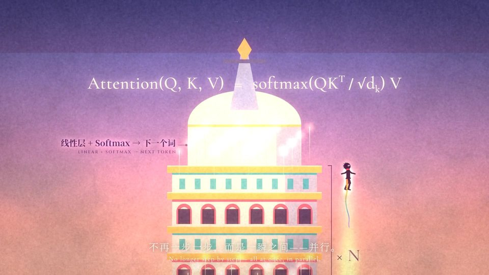 | 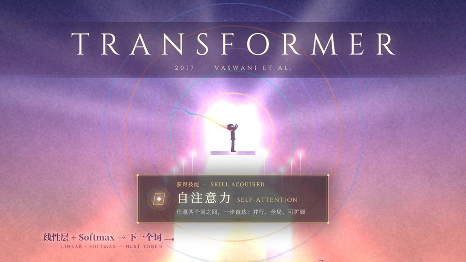 |
| 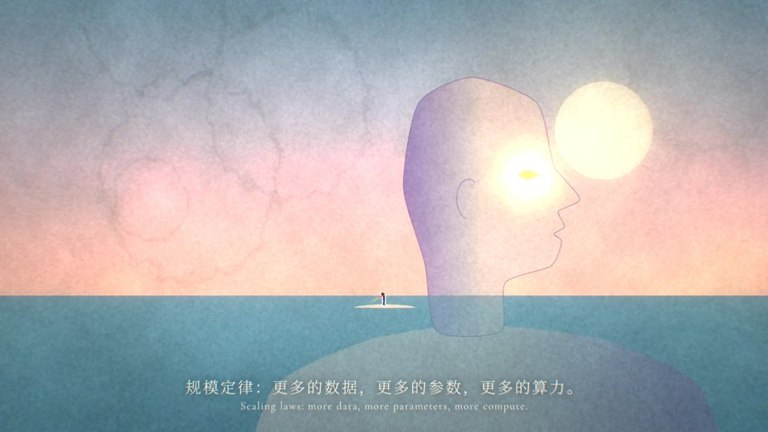 | 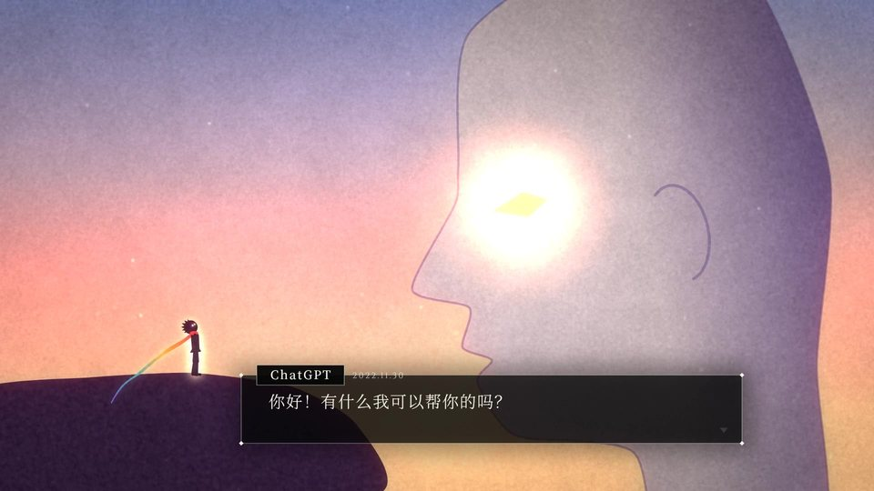 |
| 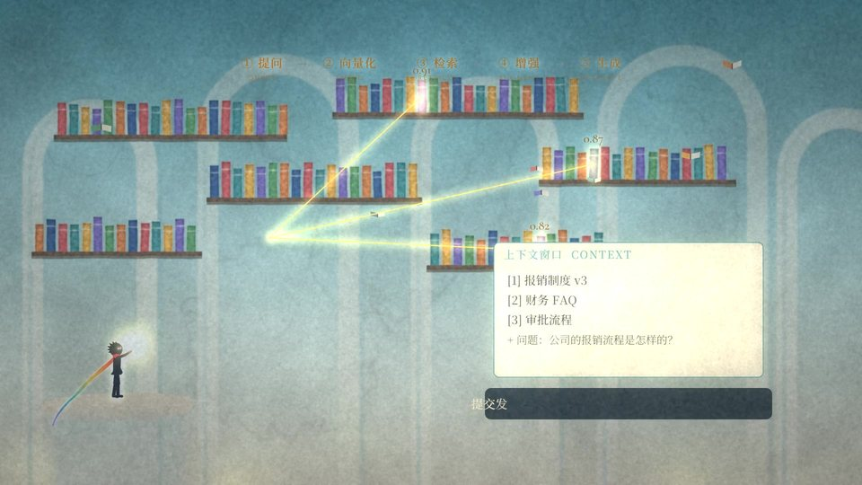 | 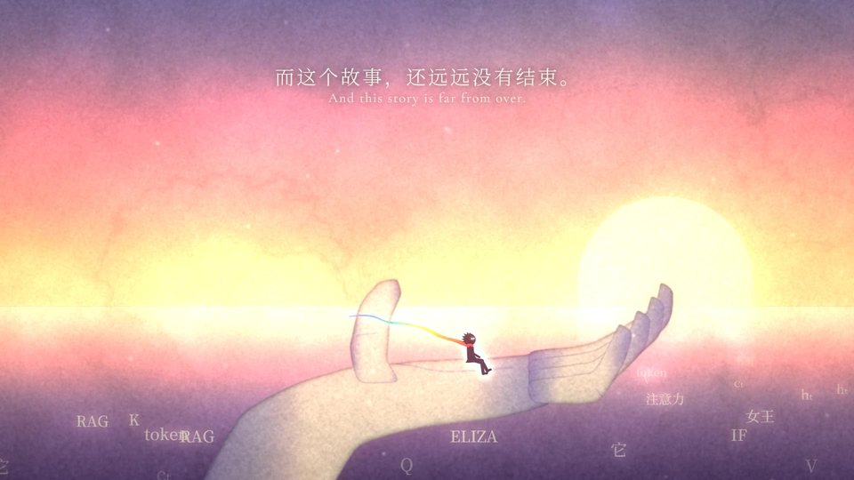 |

---

## 分镜 / 章节

| 时间 | 章节 | 画面 | 讲到的知识点 |
|---|---|---|---|
| 0:00 | **序章 · 沉默** | 黑幕字幕“起初，机器没有语言。”；LIMBO 式雾林，词元在草丛中睁开发光的双眼，起身 | 规则时代 |
| 0:18 | **标题** | 镜头上摇入林冠，`TOKEN · 词元` 浮现，光芒扫过 | — |
| 0:28 | **第一章 · 规则之森**（1950–1969） | 悬挂的 IF / THEN / ELSE / GOTO 木牌与远处转动的规则齿轮；ELIZA 终端对话（CRT 上显示它的匹配规则）；感知机之灯被点亮；XOR 之门前，一条直线三次尝试全部失败，霜冻降临 | 规则系统、ELIZA 关键词匹配、感知机（加权求和 + 阈值）、XOR 线性不可分 |
| 1:04 | **第二章 · 漫长寒冬**（1969–1986） | 暴风雪中被掩埋的专家系统与机器、远山上守灯的三个人；冰封的神经网络——触碰输出节点，**红色误差火花逆流而上**，冰层碎裂；隐藏层画出弯曲的决策带，XOR 之门打开 | AI 寒冬、**反向传播**、链式法则 ∂L/∂w、隐藏层与非线性 |
| 1:34 | **第三章 · 记忆之链**（1990–2014） | 夜色中的灯笼长桥：每盏灯是一个时间步，越远越暗；**BOSS「遗忘之蛛」**踩碎远处的记忆；LSTM 的遗忘门/输入门/输出门升起，金色的细胞状态横贯全桥，挡住了蜘蛛；“法国”沿着记忆线传到句尾，“？”变成“法语” | RNN、hₜ = tanh(W·hₜ₋₁ + U·xₜ)、**梯度消失**、LSTM 门控、长程依赖 |
| 2:10 | **第四章 · 意义之海**（2013–2014） | GRIS 式蓝色星海：词语从海面升空化为星座，平行箭头画出 **国王 − 男人 + 女人 ≈ 女王**、国家→首都；编码器/解码器双岛，一整句话被压进一颗光球，长句令其碎裂；注意力丝线把译文与原文逐词对齐 | word2vec、向量类比、Seq2Seq 瓶颈、Bahdanau 注意力 |
| 2:40 | **第五章 · 注意力**（2017） | 黑幕打出 *Attention Is All You Need*；16 个词元彼此相连的 **多头注意力网**（「它」→「动物」0.71）；**水彩色彩从「它」爆发**，遮幅打开；Transformer 之塔：位置编码的正弦丝带、并行上升的光流、`Attention(Q,K,V) = softmax(QKᵀ/√dₖ)V`；登顶加冕 TRANSFORMER | 自注意力、多头、指代消解、位置编码、并行计算、残差与归一化、前馈网络 |
| 3:24 | **第六章 · 巨人苏醒**（2018–2021） | BERT（双面石像）与 GPT（侧脸石像）从海中升起：完形填空 `[MASK]→读` vs. 逐词续写；GPT-1 → 2 → 3（1.17 亿 → 15 亿 → 1750 亿参数）规模跃迁；能力之花涌现；幻觉风暴 | 双向 vs. 自回归预训练、MLM、规模定律、涌现、幻觉 |
| 3:50 | **第七章 · 对齐**（2022） | 人们举灯为 A/B 回答投票，奖励条上涨，风暴平息、黎明到来；巨人第一次低头开口：“你好！有什么我可以帮你的吗？” | RLHF、人类偏好、奖励模型、ChatGPT（2022.11.30） |
| 4:16 | **第八章 · 无尽书库**（2020–） | RAG 五步：提问 → 向量化 → 检索 Top-k（相似度 0.91 / 0.87 / 0.82）→ 拼入上下文 → 带引用生成；前沿蒙太奇：思维链、混合专家、智能体、多模态、推理模型 | **RAG**、Embedding 检索、上下文窗口、CoT、MoE、Agent/工具调用、多模态、测试时计算 |
| 4:42 | **终章** | 词元坐在巨人摊开的掌心看日出，海面上漂过一路走来的所有符号；片尾：“下一个词，由你写下。▍” | — |

---

## 渲染

```bash
# Linux 上 skia-python 需要 libEGL
sudo apt-get install -y libegl1
pip install -r requirements.txt

# 1) 下载字体（Noto Serif SC、Cinzel、Cormorant Garamond，均为 SIL OFL）并生成静态字重
python tools/fetch_fonts.py

# 2) 合成配乐（约 1 分钟）
python audio/score.py out/score.wav

# 3) 渲染成片（4 核约 25 分钟）
python render.py --out out/token_trailer_1080p.mp4 --audio out/score.wav

# 快速预览：半分辨率
python render.py --scale 0.5 --preset veryfast --crf 23 --out out/preview.mp4 --audio out/score.wav
# 只渲染某一段 / 导出静帧（单位：秒）
python render.py --start 160 --end 204 --scale 0.5 --out out/attention.mp4
python render.py --stills 12,175,196 --scale 0.5
```

## 工程结构

```
render.py              多进程逐帧渲染 → ffmpeg（imageio-ffmpeg 自带二进制），可合入音轨
cg/core.py             设计坐标系 1920×1080、skia 画布、Layer/VLayer（预渲染位图 / 矢量 SkPicture）、缓动与噪声
cg/post.py             后期：LIMBO 调色（去色、雾化、暗角、颗粒、胶片灰尘）与 GRIS 调色（泛光、水彩纸纹）
cg/fx.py               体积光、雾、粒子（尘埃/雪/花瓣）、霜冻、水彩晕染、倒影、色彩扩散遮罩
cg/character.py        主角骨骼：FK 姿态 + 两骨 IK 行走/奔跑循环，程序化围巾，发光的眼睛
cg/props.py            树干、草、齿轮、悬挂木牌、岩石、拱门等剪影生成器
cg/text.py / ui.py     字体（逐字形回退）、字距、辉光、打字机；章节卡、技能弹窗、BOSS 卡、对话框、字幕、遮幅
cg/scenes/*.py         11 个场景（forest / rules / winter / memory / sea / attention / giants / alignment / library / epilogue）
cg/timeline.py         场景顺序与全局时间轴（音频也从这里读取时间点）
audio/synth.py         乐器与效果：加法合成钢琴、失谐锯齿弦乐、共振峰合唱、FM 钟声、低频冲击、Braam、风、脚步、混响
audio/score.py         配乐与音效编排：脚步、灯笼点亮、蜘蛛攻击、打字声等均从场景代码计算，保证音画同步
tools/fetch_fonts.py   字体下载与实例化
```

## 说明

- 片中人物、事件与年份均为真实的技术史（Rosenblatt 1958；Minsky & Papert 1969；Rumelhart, Hinton & Williams 1986；
  Hochreiter & Schmidhuber 1997；Mikolov et al. 2013；Sutskever et al. / Bahdanau et al. 2014；Vaswani et al. 2017 …），
  以游戏关卡的方式做了艺术化表达。
- GRIS 与 LIMBO 仅作为美术风格参考，本项目不包含其任何素材。
